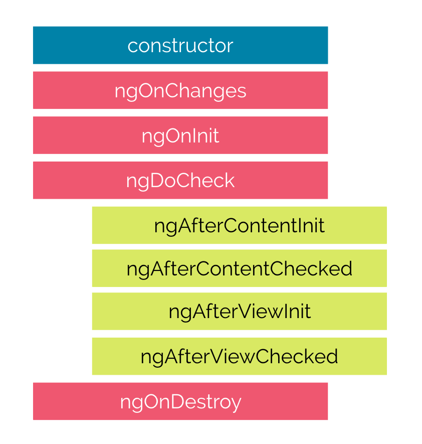
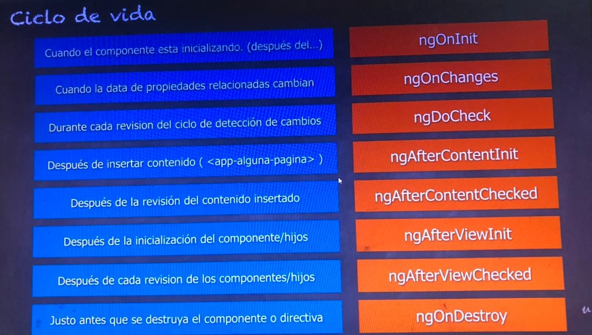

# Curso Angular: De cero a experto (Legacy)

## Seccion 2: Gentil introduccion a TypeScript y ES6

### Clase 9: ¿Que aprenderemos en esta sección?

1. ¿Qué es TypeScript?
2. ¿Cómo usar TypeScript y utilizar ECMAScript 6?
3. Declaración de variables con "let" y constantes "const"
4. ¿Qué es y para qué sirve el archivo tsconfig.json?
5. Uso de los tipos de datos que ofrece TypeScript.
6. Strings de multilinea.
7. Parámetros obligatorios, por defecto y opcionales.
8. Beneficios de las funciones de flecha.
9. Uso y creación de interfaces.
10. Uso de módulos y ejemplos de los mismos.
11. Decoradores de clase.
12. Entre otros temas importantes para adentrarnos en Angular 2.

### Clase 10: Introduccion a TypeScript

JavaScript no fue diseñado para aplicaciones de mediana y gran escala es por esto que surgen los frameworks y librerias como lo son: *Angular, React y Vue*. JavaScript tiene una debilidad la cual es que al utilizar una funcion no sabemos si estamos mandando mal un argumento porque puede ser que este piendo un objetos y se le estaba mandando numeros, string u otra cosa.


TypeScript no corre directamente en el navegador, por ende hay que compilarlo o traducirloy generarlo como un archivo de JS.


Con TypeScript se pueden utilizar carecteristicas nuevas del futuro HOY, con la confianza que tenemos la compatibilidad óptima, con un codigo mas ordenado y compresivo.

### Clase 12: Configuracion de TypeScript

`tsc -w` para entrar en modo observador que sirve para visualizar errores y que *TS*  se traduzca directamente a *JS*

### Clase 13: Variables let y const

`var` y `let` se emplean para la definicion de variables y `const` para las constantes. Aunque aparentemente `var` y `let` parecen ser iguales esto no es así debido a que cada una tiene un alcance diferente.

- **Var**: Tiene un ambito global o un ámbito de función/local. El ambito global abarca cuando una funcion se declara por fuera de una funcion. Esto significa que cualquier variable que se declare con var fuera de una función está disponible para su uso en toda la pantalla.

- **Let**: Tiene un ambito por bloques{}. Así que una variable declarada en un bloque con `let`  solo está disponible para su uso dentro de ese bloque. Una particularidad de esta es que `let` puede modificarse pero no volver a declarar.

- **Const**: Las variables declaradas con `const` mantienen valores constantes. Al igual que las declaraciones `let`, solamente se puede acceder a las declaraciones `const` dentro del bloque en el que fueron declaradas. `const` no puede modificarse ni volver a declararse.

### Clase 16: Template literales del ES6

Las plantillas literales son cadenas literales que habilitan el uso de expresiones incrustadas. Con ellas, es posible utilizar cadenas de caracteres de más de una línea, y funcionalidades de interpolación de cadenas de caracteres.

```ts
`texto de cadena de caracteres`

`línea 1 de la cadena de caracteres
 línea 2 de la cadena de caracteres`

`texto de cadena de caracteres ${expresión} texto adicional`

const salida = `${nombre} ${apellido} ( ${edad} )`;
```
### Clase #17: Funciones --> Parametros opcionales, obligatorios y por defecto

__Parametros obligatorios__:
``` ts
parametro : any
```

__Parametros opcionales__:
``` ts
parametro? : any
```

__Parametros por defecto__:
``` ts
parametro : any = 'xxx'
```

### Clase #18: Funciones de Flecha

Esto crea una función `func` que acepta los parámetros `arg1..argN`, luego evalúa la `expression` del lado derecho mediante su uso y devuelve su resultado.

Una expresión de función flecha es una alternativa compacta a una expresión de función tradicional. 

#### Sintaxis basica

``` ts
param => expression
```
#### Comparativa
``` ts
// Función tradicional
function (a){
  return a + 100;
}

// Función flecha
a => a + 100;
```

### Clase 19: Desestructuracion de Objetos y Arreglos

La desestructuracion es una funcionalidad fascinante que vino junto con ES6. Es una expresión de JavaScript que permite desempacar valores de arreglos o propiedades de objetos en distintas variables. Es decir, se pueden extraer datos de arreglos y objectos y asignarlos a variables.

Esto soluciona lo repetitivo que podia lograr ser obtenr valores de un arrego.

__Nota__: Para la desestructuracion de los _objetos_ se usa: `{}`, en caso de _arrays_ se usa: `[]`

Ejemplo: Antes de la desestructuracion
``` js
let introduccion = ["Hola", "Yo" , "soy", "Sarah"];
let [saludo, pronombre] = introduccion;

console.log(saludo); // "Hola"
console.log(pronombre); // "Yo"
```

Ejemplo: Despues de la desestruturacion
``` ts
let [saludo, pronombre] = ["Hola", "Yo" , "soy", "Sarah"];

console.log(saludo); // "Hola"
console.log(pronombre); // "Yo"

================================================

let [saludo, ...introduccion] = ["Hola", "Yo" , "soy", "Sarah"];

console.log(saludo); // "Hola"
console.log(introduccion); // ["Yo", "soy", "Sarah"]
```

### Clase 20: Promesas

Una promesa es un objeto que representa la terminación o el fracaso de una operación asíncrona. Esencialmente, una promesa es un objeto devuelto al cuál se adjuntan funciones `callback`, en lugar de pasar callbacks a una función.

> 
    Considera la función crearArchivoAudioAsync(), el cuál genera de manera 
    asíncrona un archivo de sonido de acuerdo a un archivo de configuración, 
    y dos funciones callback, una que es llamada si el archivo de audio es 
    creado satisfactoriamente, y la otra que es llamada si ocurre un error. 
    El código podría verse de la siguiente forma:

``` ts
function exitoCallback(resultado) {
  console.log("Archivo de audio disponible en la URL " + resultado);
}

function falloCallback(error) {
  console.log("Error generando archivo de audio " + error);
}

crearArchivoAudioAsync(audioConfig, exitoCallback, falloCallback);
```

### Clase 22: Interfaces en TypeScript

Las interfaces son un tipo de construcción utilizada en la Programación Orientada a Objetos que tratan de suplir la carencia de la herencia multiple. las interfaces son como un contrato, en el que se especifica las cosas que debe contener una clase para que pueda implementar una interfaz.

_Nota_: 
> En TypeScript se pueden definir propiedades, mientras que en otros lenguajes las interfaces sólo definen métodos.

``` ts
interface citaCalendario {
  fechaHora: Date;
  titulo: string;
  lugar: string;
}

let cita1: citaCalendario;
```

### Clase 23: Introduccion a las clases de POO

Una __clase__ es la representacion viva de un __objeto__ de la vida real y ese __objeto__ tiene acciones que en POO se llaman __metodos__.


La **herencia** es transimir todas las propiedad de esta a otra clase.


### Clase 24: Definicion de una clase basica en TypeScript

``` ts
class Persona {
  nombre: string;
  edad: number;

  constructor(nombre:string, edad:number) {
    this.nombre = nombre;
    this.edad = edad;
  }

  imprimir() {
    console.log(`Nombre: ${this.nombre} y edad:${this.edad}`);
  }
}

let persona1: Persona;
persona1 = new Persona('Juan', 45);
persona1.imprimir();
```

### Clase 26: Decoradores

Los decoradores son unos patrónes de diseño estructural que permite añadir dinámicamente nuevos comportamientos a objetos colocándolos dentro de objetos especiales que los envuelven . TypeScript podemos usarlos activando la propiedad `experimentalDecorators` del `tsconfig.json` de nuestro proyecto o si decidimos compilar mediante el comando `tsc`, colocar siempre la opción de `--experimentalDecorators ---target` ES5.

``` ts
function classDecorator(target:Function) {
    console.log(target);
}

@classDecorator
class MyClass {
    constructor() { 
        console.log('My class')
    }
}
```

## Seccion 3: Aplicacion #1: Hola Mundo

### Clase 34: ¿Que aprenderemos en esta sección?

1. ¿Qué son los componentes?
2. ¿Qué son las directivas estructurales?
3. Uso de plunker para nuestra primera interacción con Angular.
4. Trabajando de forma local un proyecto en Angular.
5. Una breve introducción sobre todos los archivos usados en el QuickStart de Angular.
6. Uso de Bootstrap 4 para nuestros estilos.
7. Crear archivos .HTML para que se encarguen de la estructura visual de nuestros componentes.
8. Crearemos una aplicación con 3 componentes re-utilizables.
9. *ngFor y el *ngIf

### Clase 36: Introduccion a los componentes y directivas estructurales

#### Componentes

Un componentes son pequeñas clases que cumplen(vistas) una tarea especifica. 

Ejemplo: Menu de navegacion, barra lateral(side bar), lugar de información, pie de pagina


#### Directivas estructurales

Son instrucciones que le dicen a la parte del HTML(template) que tiene que hacer.

- __ngIF__: Se encarga de mostrar u ocultar elemteos HTML en la pagina web.
- __ngFor__: Se engarca de hacer repeticiones de elementos HTML en la pagina web


### Clase 37: Primera interaccion en Angular

En la documentacion oficial de [Angular](http://angular.io) hay informacion para ayudar a construir una pagina web.

- __Pk__: Paquete o modulo
- __I__: Interfaces
- __C__: Clase
- __K__: Constante
- __F__: Funcion
- __E__: Enumeracion
- __P__: Pipe

### Clase 40: Estructura del proyecto

- __node_modules__: Esta carpeta contiene los paquetes del proyecto
- __src__: Es la carpeta donde esta la aplicacion de angular
- __.editconfig__: Archivo con las configuraciones del editor
- __.gitignore__: Este archivo ignora  lo que no ueremos que se monte al repositorio.
- __angular__.json: Le dice a angular como es nuestra aplicacion y como debe de funcionar
- __package__-lock.json: Le dice a node como es creado el `package.json`
- __package__.json: Se crea de forma automatica donde se encuentran las diferentes dependencias
- __Readme__.md: Explica el code
- __tsconfig__.json: Como debe de trabajar ts la app con que estandar queremos correr la app.

- __app__: La aplicacion con sus archivos para la estructuracion del componente
- __assests__: Para tener los recursos estaticos
- __environments__: Para tener las variables de ambiente de produccion y desarrollo
- __main__.ts: Es lo primero que ejecuta angular al lanzar el proyecto

### Clase 43: Creando el footer.component

Para crear un componente se debe de ejecutar el siguiente comando: `ng generate component (ruta)/nombre`


### Clase 45: Directivas estructurales: *ngFor y el ngIf

Las directivas *ngIf y *ngFor son directivas de angular que podemos agregarle a los elementos HTML.

- __ngIf__: Permite evaluar de forma condicional una condición que devolverá un resultado booleano (true or false) y dicho  resultado se suele utilizar con la finalidad de mostrar u ocultar una información.

- __ngFor__: Permite iterar una array, objeto, etc. Normalmente con el fin de insertar cada uno de los elementos contenidos en su interior


El `ngFor` trabaja con base a arreglos y el `ngIf` con base a expresiónes que den resultados de tipo booleano.

## Seccion 4: Aplicacion #2: Aplicacion de una sola pagina SPA

### Clase 48: ¿Qué veremos en esta sección?

1. Crearemos una aplicación de una sola página (Single Page Application)
2. Creación de proyectos de Angular usando el CLI (Command Line Interface)
3. Instalando bootstrap o librerías de terceros usando el Angular-CLI
4. Creación de rutas de nuestra aplicación
5. Uso de RouterLink y RouterLinkActive para movernos de página y colocar clases a los elementos activos.
6. Uso del modulo Router, que nos permite movernos de página mediante código.
7. Obtención de parámetros vía URL.
8. Configuración de nuestro primer servicio en Angular para el manejo de la data.
9. Breve introducción a los Pipes 
10. Uso del buscador del navbar para realizar una consulta a nuestro arreglo de héroes.


### Clase 57: Introduccion a los servicios

 Los servicios son clases que se encargan de acceder a los datos para entregarlos a los componentes.

Tienen caracteristicas principales como: 
  > 
    - Brindar informacion a quien lo necesite
    - Realizar peticiones CRUD (create, read, update, delete)
    - Mantener la data de forma persistente
    - Servir como recurso re-utilizable para nuestra aplicación

### Clase 64: Pipes: Transformacion visual de la data

Es una utilidad en Angular que nos permite transformar los datos, , a la hora de mostrarlos en los templates de los componentes.

## Seccion 5: Pipes -Transforman los valores mostrados en pantalla

### Clase 73: Introduccion a la seccion

Un pipe es un metodo o una funcion la cual recibe _x_ cantidad de argumentos, por lo menos siempre va recibir uno para procesarlo y emitiendo una salida pronosticada.

_Nota_: La salida no muta el objeto que se recibe como argumento, sola la transformar de forma visual.

### Clase 74: ¿Que aprenderemos en esta sección?

1. Pipes uppercase y lowercase
2. Pipe Slice
3. Pice Decimal
4. Pipe Percent
5. Pipe Currency
6. Pipe Json
7. Pipe Async
8. Pipe Date
9. Pipes personalizados
9.1. Capitalizar palabras y nombres
9.2. Creacion de un pipe, que permite cargar recursos externos de forma segura.

### Clase 75: Inicio del proyecto y la introduccion a los Pipes

Pipes (Tuberias) `|`

Sirven para transformar la data de manera visual

EjemploS:

``` ts
const texto = "Hola mundo"
{{ texto | uppercase}}

//Resultado
HOLA MUNDO
----------------------------------------------------------------

fecha = new Date(2010, 10, 15)
{{fecha | date:"dd/mm/yy"}}

//Resultado
15/12/2010
```

### Clase 77: Pipe -> Slice

Crea un nuevo `Array` o `String` que contiene un subconjunto (porción) de los elementos.

``` ts  
{{ value_expression | slice : start [ : end ] }}
```

## Seccioin 6: Aplicacion #3: SpotiApp

### Clase 91. ¿Qué aprenderemos en esta seccion?

1. Reforzamiento de rutas y parámetros de rutas.
2. Uso de carruseles del Bootstrap 4
3. Uso del HTTP para obtener información
4. Uso de la API de Spotify para obtener información de:
4.1. Artistas
4.2. Albumes
4.3. Audio
5. Trabajo sobre el manejo de data asíncrona.
6. ngModel para enlazar campos de texto a variables del componente.
7. Widgets de Spotify
8. HTML5 audio
9. Observables
10. Maps

## Seccion 7: Aplicacion #4: Lista de deseos - IONIC

### Clase 115. ¿Qué aprenderemos en esta seccion?

1. Uso del local storage guardar localmente información para nuestras aplicaciones.
2. Introducción a ionic.
3. Uso del framework de ionic.
4. Uso de servicios que afectan el local storage.
5. Uso de ionic DevApp para desplegar nuestra aplicación
6. Aprenderemos a controlar estilos usando Angular.
7. Manejo de la información a través de servicios ( update, delete, insert y select ) al local storage.
8. Aprenderemos a utilizar pipes impuros para realizar filtros.

### Clase 116. ¿Que es ionic?

Ionic es un framework SDK de frontend para desarrollar aplicaciones hibridas basado en tecnologias web(HTML, CSS y JS). Es decir, un framework que nos permite desarrollar aplicaciones para iOS nativo, Android y la web, desde una única base de código. Su compatibilidad y, gracias a la implementación de Cordova e Ionic Native, hacen posible trabajar con componentes híbridos. Se integra con los principales frameworks de frontend, como Angular, React y Vue, aunque también se puede usar Vanilla JavaScript.

### Clase 136: ¿Editar el titulo de la lista?

El decorador `@ViewChield()` devuelve el primer elemento que coincide con una directiva, un componente o un selector de referencia de plantillas concreto.


## Seccion 8: Componentes, directivas de atributos, ciclo de vida y más...

### Clase 139: ¿Qué aprenderemos en esta seccion?

1. Cambios en el estilo de algún elemento HTML utilizando variables en los componentes.
2. Comprender y aplicar CSS en un determinado scope, sin afectar los demás componentes. 
3. Adicionar y remover clases según variables o cualquier tipo de condición.
4. Crearemos directivas personalizadas.
5. Uso del ngSwitch.
6. Crearemos una pequeña aplicación para el uso de rutas y rutas hijas.
7. Comprenderemos el ciclo de vida de un componente o directiva.

### Clase 142: ngStyle y su uso con directivas de atributos.

La directiva de atributo ngStyle actualiza los estilos para un elemento HTML determinado.

Establece una o más propiedades de estilo, especificadas como pares clave-valor separados por dos puntos. La clave es un nombre de estilo y el valor es una expresión a evaluar o valor a asignar.

``` ts
<h1 [ngStyle]="{'color':'red','background-color':'#ff0','text-align':'center'}">Sitio fuera de servicio</h1>
```

### Clase 144: ngClass - agregando clases de estilos a nuestos elementos HTML

La directiva de atributo `[ngClass]` permite establecer una o más clases a un elemento HTML, que nos permite alterar las clases CSS que tienen los elementos de la página.

``` ts
.clase1 {
    color:red;
    background-color:blue;
}

.clase2 {
    font-size:20px;
    font-family: 'Courier New', Courier, monospace;
}

<p [ngClass]="'clase1 clase2'">Prueba de directiva ngClass</p>
```

### Clase 146: Directivas personalizadas
Las Angular customs directives sirven para construir una directiva personalizada es decir en vez de usar una directiva existente como  ngClass o *ngIf podemos construir nuestras propias directivas y aumentar la extensibilidad de nuestro código.


### Clase 147: ngSwitch - Multiples opciones con uan sola decision

La directiva `ng-switch` es similar a __`ng-if`__ y como nos podemos imaginar es como el switch de la programación. Es decir que permite que entre varios conjuntos de tags solo esté uno de ellos, borrando los que no cumplen la condición. 

- Todas las vistas que coinciden se muestran.
- Si no hay coincidencias, se representa una vista con la directiva __`ngSwitchDefault`__ .

``` ts
<container-element [ngSwitch]="switch_expression">
  <! - la misma vista se puede mostrar en más de un caso ->
  <some-element *ngSwitchCase="match_expression_1">...</some-element>
  <some-element *ngSwitchCase="match_expression_2">...</some-element>
  <some-other-element *ngSwitchCase="match_expression_3">...</some-other-element>
  <! - caso predeterminado cuando no hay coincidencias ->
  <some-element *ngSwitchDefault>...</some-element>
</container-element>
```

### Clase 152: Ciclo de vida completo de un componente
En angular los componentes son los principales pilares de la aplicación,  cada componente tiene un ciclo de vida, una cantidad de etapas diferentes que atraviesa. Hay 8 etapas diferentes en el ciclo de vida de los componentes. Cada etapa se denomina `lifecycle hook event` o en ‘evento de enlace de ciclo de vida’. Podemos utilizar estos eventos en diferentes fases de nuestra aplicación para obtener el control de los componentes. Como un componente es una clase de TypeScript, cada componente debe tener un método constructor.

El constructor de la clase de componente se ejecuta primero, antes de la ejecución de cualquier otro lifecycle hook. Si necesitamos inyectar dependencias en el componente, el constructor es el mejor lugar para hacerlo. Después de ejecutar el constructor, Angular ejecuta sus métodos de enganche de ciclo de vida en un orden específico.




Mas imformacion en el [Blog](https://medium.com/angular-chile/angular-componentes-y-sus-ciclos-de-vida-aa639e13a688)

## Seccion 9: Aplicacion #5 --> Aplicacion con autenticacion Auth0

### Clase 155: ¿Qué aprenderemos en esta seccion?

Se trabajara en una pequeña aplicacion que tendra como finalidad, utilizar un sisitema de autenticacion de usuarios Auth0.

Temas:
  > 
    1. ¿Qué es Auth0 y la documentación basada en Angular 2?
    2. Autenticación con Facebook, Twitter, Google, entre otros...
    3. Creación de un formulario de captura para la creación de usuarios.
    4. Personalización de la caja de login.
    5. Uso de servicios para bloquear rutas que no son válidas si el usuario no esta autenticado.
    6. Obtener la información del perfil del usuario ingresado.

### Clase 159: Comenzando con Auth0 - Componentes y servicios

Una URL de __callback__ es una URL en su aplicación donde Auth0 redirige al usuario después de que se haya autenticado.

## Seccion 10: Bonus: Login tradicional y manejo de tokens - Firebase

### Clase 166: ¿Qué aprenderemos en esta seccion?

Trabajaremos con un proceso de autenticacion por token tradicional

Temas de la seccion:
  >
    1. Validar formularios
    2. Tokens
    3. LocalStorage
    4. Borrar tokens
    5. Caducidad de tokens
    6. Creación de usuarios
    7. Posteos
    8. Firebase REST API

### Clase 174: Firebase y servicios REST

Firebase es una plataforma para el desarrollo de aplicaciones web y aplicaciones móviles, trabaja como una base de datos NoSQL tipo documento manejando los datos en tiempo real. Su función esencial es hacer más sencilla la creación de tanto aplicaciones webs como móviles y su desarrollo, procurando que el trabajo sea más rápido, pero sin renunciar a la calidad requerida.

Los servicios web RESTful son aplicaciones cliente-servidor a través de la red que manipulan el estado de los recursos. En este contexto, la manipulación de los recursos significa creación de recursos, recuperación, modificación y borrado.

### Clase 176: Login de usuarios
El token de autenticación nos dice quién hace la solicitud y qué acciones puede realizar ese usuario. La autenticación por token es algo que se tiene que hacer del lado del servidor. 

Para evitar que en cada llamada el usuario deba entregar su clave y password se usa un token.

### Clase 180: Guard para proteger la ruta sin autenticación
Los Guards en Angular, son de alguna manera: middlewares que se ejecutan antes de cargar una ruta y determinan si se puede cargar dicha ruta o no.

1. __(CanActivate)__ Antes de cargar los componentes de la ruta.
2. __(CanLoad)__ Antes de cargar los recursos (assets) de la ruta.
3. __(CanDeactivate)__ Antes de intentar salir de la ruta actual (usualmente utilizado para evitar salir de una ruta, si no se han guardado los datos).
4. __(CanActivateChild)__ Antes de cargar las rutas hijas de la ruta actual.

Como middleware, estos componentes se ejecutan de manera intermedia antes de determinadas acciones y si retorna `true` la ruta seguiría su carga normal, en caso negativo, el Guard retornaría `false` y la ruta no se cargaría. Generalmente en caso de que no se cumpla la condición del Guard, se suele hacer una redirección a la ruta anterior o a una ruta definida como la interfaz de autenticación.

## Seccion 11: Formularios en angular

### Clase 185: ¿Que aprenderemos en esta sección?

1. Diferentes aproximaciones que tiene angular para trabajar formularios.
2. Profundizaremos en el uso del ngModel.
3. Utilizar las validaciones pre fabricadas.
4. Crear validaciones personalizadas.
5. Crear validaciones asíncronas.
6. Realizar un submit utilizando el ngSubmit.
7. Postear información únicamente cuando el formulario es valido,
8. Crear formularios del lado del componente.
9. Cargar información por defecto a los formularios.
10. Subscribirnos a los cambios de los valores de los formularios.

### Clase 188: Creacion de componentes - Formularios y Rutas

Formularios basados ​​en plantillas __(Template Forms)__ y formularios reactivos __(Reactive Forms).__

1. Los formularios basados ​​en plantillas utilizan el “FormsModule”, mientras que los formularios reactivos se basan en “ReactiveFormsModule”.
2. Los formularios basados ​​en plantillas son de naturaleza asincrónica, mientras que los formularios reactivos son en su mayoría sincrónicos.
3. En un enfoque basado en plantillas, la mayor parte de la lógica se basa en la plantilla, mientras que en el enfoque basado en reactivos, la lógica reside principalmente en el componente.

Los formularios reactivos están basados en flujos de datos de tipo Observable, donde cada entrada y cada valor toman la forma de un flujo de datos que puede ser accedido de manera asíncrona.

## Seccion 12: Formularios en Angular

### Clase 214: ¿Que aprenderemos en esta sección?

1. Uso del modulo HTTP.
2. Utilizaremos los servicios restful de Firebase
3. POST.
4. GET.
5. DELETE.
6. PUT.
7. Configuraciones en la consola de Firebase.

## Seccion 13: Aplicacion #7: FireCha - AngularFire2

### Clase 230: ¿Que aprenderemos en esta sección?

1. Uso de AngularFire2 - Librería oficial de angular para conectarse a Firebase.
2. Crear observables para escuchar mediante sockets los cambios en Firebase.
3. Utilizaremos la autenticación de Google y Twitter para nuestro chat.
4. Uso de AngularFire2 para manejar las inserciones.
5. Uso de promesas para poder ejecutar funciones cuando detectamos cambios en la base de datos.
6. Usaremos el local storage para almacenar información del login para mantener las sesión.
7. Entre otras cosas útiles.

## Seccion 14: Aplicacion #8: PeliculasApps

Se trabajara con API llamada __TheMobieApp__ API, para hacer una aplicacion de bsquedad de peliculas.

Temas puntuales de la seccion como:

1. Http Get
2. Operadores de RXJS como el Tap y Map
3. Combinar observables
4. Módulos
5. Estructura de un proyecto real
6. Servicios
7. Slideshow
8. Swiper

### Clase 247: Modulos Angular

Un **módulo de Angular**, es un conjunto de código dedicado a un ámbito concreto de la aplicación, o una funcionalidad específica y se **define mediante una clase decorada con @NgModule**.

### Decorador @NgModule

NgModulees un decorador que recibe un objeto de metadatos que definen el módulo. Los metadatos más importantes de un NgModule son:

1. **declarations:** Las vistas que pertenecen a tu módulo. Hay 3 tipos de clases de tipo vista: _componentes_, _directivas_ y _pipes_.
2. **exports:** Conjunto de declaraciones que deben ser accesibles para templates de componentes de otros módulos.
3. **imports:** Otros NgModules, cuyas clases exportadas son requeridas por templates de componentes de este módulo.
4. **providers:** Los servicios que necesita este módulo, y que estarán disponibles para toda la aplicación.
5. **bootstrap:** Define la vista raíz. Utilizado solo por el root module.

[Blog Modulos](http://blog.enriqueoriol.com/2017/03/introduccion-angular-modulo-y-componente.html#:~:text=Un%20módulo%20de%20Angular%2C%20es,principal%20(o%20root%20module).)

### Clase 257: InfinitiScroll peliculas

`@HostListener('')` Decorador que declara un evento DOM para escuchar,y proporciona un método de manejo para ejecutar cuando ese evento ocurre.

Angular invoca el método manejador suministrado cuando el elemento anfitrión emite el evento especificado,y actualiza el elemento vinculado con el resultado.

Si el método del controlador devuelve falso, aplica preventDefault en el elemento enlazado.

[Blog](https://runebook.dev/es/docs/angular/api/core/hostlistener#:~:text=Angular%20-%20HostListener%20-%20decorator%20Decorador%20que,y%20proporciona%20un%20mét%20-%20Español)

## Seccion 16: Aplicacion #9: Uso de Google Maps

### Clase 273: ¿Que aprenderemos en esta sección?

1. Uso de Google Maps en un proyecto con Angular
2. Creación del API KEY de Google Maps
3. Uso de Reactive Forms - FormBuilder
4. Creación de marcadores en el mapa
5. Eventos y diversas interacciones con los mapas
6. Edición de marcadores
7. Uso de Angular Material en el proyecto
7.1. Dialogs
7.2. Snacks
7.3. Inputs
7.4. Toolbars
7.5. Themes

### Clase 278: Componente mapa y diseño

Para decirle a **AngularCLI** en que modulo queremos que se instale un *componente* cuando hay varios *modulos* en una misma linea usamos `--module=(nombre del modulo).module`

### Clase 284: Dialog - Mostrar un modal para la ediccion del marcador

Los **entryComponents** son cualquier componente que Angular carga imperativamente (lo que significa que no está haciendo referencia a él en la plantilla), por tipo. Usted especifica un componente de entrada al iniciarlo en un NgModule o al incluirlo en una definición de enrutamiento.

``` ts
 const dialogRef = this.dialog.open( MapaEditarComponent , {
      width: '250px',
      data: { titulo: marcador.titulo, desc: marcador.desc }
    });
```

_Nota_
> Acctualmente esta en desuso

## Seccion 17: Aplicacion #10: Canal de Youtube

### Clase 289: ¿Que aprenderemos en esta sección?

El objetivo es enseñar a utilizar la API de youtube y repasar lo aprendido hasta el curso.

1. Creación de una API KEY para accesar los servicios de YouTube API v3a
2. Uso de la documentación de YouTube para obtener información de un canal
3. Obtener una lista de reproducción
4. Crear una página en la cual pueda cargar los videos de forma paginada
5. Usar el Token de respuesta de la api de YouTube
6. Trabajar con tipado de datos
7. SweetAlert2

## Seccion 18: Desplegandolas aplicaciones a produccion.

### Clase 301: ¿Que aprenderemos en esta sección?

1. Crear los archivos de distribución de nuestra aplicación
2. Crear los archivos para realizar pruebas de Pre-Producción
3. Montarlo en un servidor diferente para probar la aplicación

El objetivo es aprender a crear lso archivos que necesitamos utilizar para poder desplegarlos en el servidor de despliegue sin importar la plataforma que se este utilizando.

### Clase 302. Generando la carpeta dist

El comando `ng build` permite hacer más cosas enfocadas a desplegar en producción: Hace el minify uglify, es decir, reduce el tamaño del código, quitando los espacios en blanco y acortando el nombre de las variables.

Nota: Para vericar que todo este en produccion antes de ejecutar el comando `http-serve` se debe poner `ng build --prod --configuration production` para que asi los url a punten a la misma ruta.

## Seccion 19: 

### Clase 307: ¿Que aprenderemos en esta seccion?

1. Darles todos los códigos fuente de los programas creados a lo largo del curso
2. Darles el manual oficial de la guía de estilos para TypeScript y Angular 2
3. Información adicional sobre Angular-CLI
4. Referencias para aprender más sobre TypeScript
5. Un framework de estilos usando el material design
6. Un ejercicio adicional oficial de Angular, para seguir practicando lo aprendido

La seccion tiene como objetivo dar mas documentación para aprender lo mas posible sobre el framework Angular.

### Clase 309: Guia de estilos oficial de Angular

El equipo de angular ha creado una documentación con recomendaciones, alertas y casos en los que se debe evitar cierto tipo de codificación. 

[Guia](https://angular.io/guide/styleguide)


### Clase 310: Mas informacion sobre Angular-CLI

[Documentacion](https://angular.io/cli)

### Clase 311: Handbook de TypeScript

[TypeScript](https://www.typescriptlang.org/docs/handbook/basic-types.html)

### Clase 312: Angular Material

Angular Material es una guía de estilos similar al Bootstra

[Material](https://material.angular.io)

## Seccion 20: Bonus -Fileupload hacia Firebase

### Clase 314: ¿Que aprenderemos en esta seccion?

El objetivo es aprender a realizar subidas de archivos al Storage de Firebase.

Veremos temas sobre:

1. Uso de directivas
2. Detalles del Hostlistener
3. Input y Outputs
4. Storage de Firebase
5. uploadTask de Firebase
6. Evento drop, dragenter, dragleave, dragover
7. Uso de tipo de dato File

### Clase 321: Directiva del DropZone

Al igual que las directivas de atributo personalizadas, en Angular podemos crear nuestras propias directivas estructurales a parte de las internas de framework: *ngFor, *ngIf, *ngSwitchCase y *ngSwitchDefault.

Recordemos que las directivas estructurales tienen por objetivo añadir, manipular o eliminar elementos del DOM (Document Object Model)

## Seccion 21: Actualizaciones sobre Angular 4,5,6 y Angular-CLI


### Clase 329: Puntos importantes sobre Angular

Angular ha realizado una actualización mayor que es compatible con cualquier versión utilizada desde la 2.x.x, por lo que no es motivo para que la gente se sienta preocupada.

Angular es ahora más pequeño, más rápido, los archivos generados también son más pequeños.

### Clase 334: Nuevo: ngIf - else - then. Angular 4 > 

*ngIf se usa para manipular elementos HTTP representados en una página. Funciona en una condición en la que le decimos a la aplicación web que realice una determinada función después de que se hayan establecido algunos parámetros.

#### *ngIf con else

Cuando la condición `*ngIf` se combina con la declaración `else`, nos ayuda a decidir qué contenido queremos que aparezca en la página web en cualquier momento. Este metodo requiere usar el __ng-template__.

``` ts
h1>*ngIf in ANgular</h1>
<h2 *ngIf="displayMe else elseBlock">
  Hi, Youtube
</h2>
<ng-template #elseBlock>
<h2>
    Hi, Twitter
    </h2>
</ng-template>

```
En este caso cuando cuando la variable _displayMe_ tenga un valor verdadero mostrara Youtube y cuando sea falso Twitter.

#### *ngIf con else y then

Cuando se usa con `*ngIf` y `else`, la instrucción then permite manipular contenidos dentro de la __plantilla ng.__

Es una solución bienvenida para un codificador que quiere mantener un archivo de código estructurado y bien organizado.

``` ts
<h1>*ngIf in ANgular</h1>
<h2 *ngIf="displayMe; then ifBlock else elseBlock">
  Hi, Youtube
</h2>
<ng-template #ifBlock>
<h2>
    Hi, Google
    </h2>
</ng-template>
<ng-template #elseBlock>
<h2>
    Hi, Twitter
    </h2>
</ng-template>
```

En este caso cuando el _displayMe_ tenga un valor verdadero, se mostrará Hi, Google, y cuando sea el valor falso, se mostrará Hi, Twitter.

## Seccion 22: Graficas Dinamicas en Angular

### Clase 335: ¿Que aprenderemos en esta seccion?

El objetivo es enseñar a usar gráficas dinámicas en Angular.

Los temas a tratar son:

1. Instalaciones necesarias
2. Configuraciones
3. Gráfico de Barras
4. Gráfico de Donas
5. Gráfico de Radar

## Seccion 23: Virtual Scrool y Drag-Drop nuevo en Angular7

### Clase 344: Temas puntuales de la sección

Principalmente nos enfocaremos en dos temas principales:

1. Drag and Drop de Angular
2. Virtual Scroll

Para instalar las dependencias se usa: `@angular/cdk`

#### Virtualscroll
Virtual scrolling es una funcionalidad que salió en Angular 7 que nos permite mostrar varios elementos de una forma mas optima, ya que si por ejemplo, tuviéramos 1000 elementos, no mostraría los 1000 elementos sino que al hacer scroll iría cambiando los elementos, haciendo que tengamos menos elementos realment.

Para la etiqueta: `<cdk-virtual-scroll-viewport>`

#### Drag and Drop
Drag and drop es una funcionalidad que salió en Angular 7 que nos permite mover elementos de una zona a otra «arrastrando» y «soltando», es muy visual a nivel de usuario.

Para la etiqueta: `cdkDrag`

## Seccion 24: Bonus: Angular, Firestore, Firebase functions, deployment y mas.
