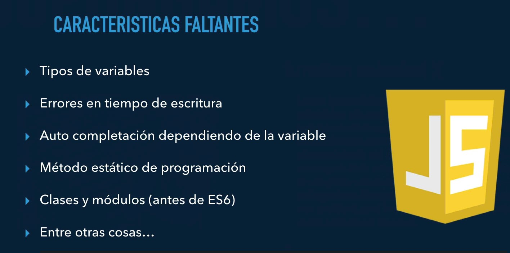
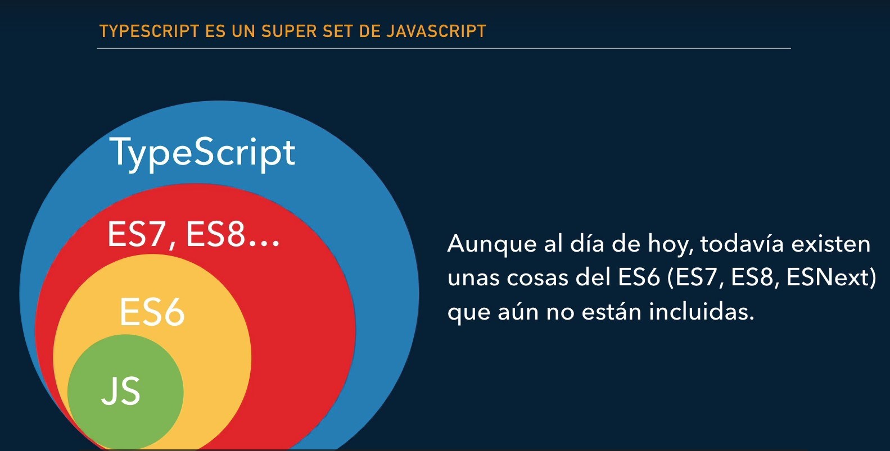

# Curso Angular: De cero a experto (Legacy)

## Seccion 2: Gentil introduccion a TypeScript y ES6

### Clase 9: ¿Que aprenderemos en esta sección?

1. ¿Qué es TypeScript?
2. ¿Cómo usar TypeScript y utilizar ECMAScript 6?
3. Declaración de variables con "let" y constantes "const"
4. ¿Qué es y para qué sirve el archivo tsconfig.json?
5. Uso de los tipos de datos que ofrece TypeScript.
6. Strings de multilinea.
7. Parámetros obligatorios, por defecto y opcionales.
8. Beneficios de las funciones de flecha.
9. Uso y creación de interfaces.
10. Uso de módulos y ejemplos de los mismos.
11. Decoradores de clase.
12. Entre otros temas importantes para adentrarnos en Angular 2.

### Clase 10: Introduccion a TypeScript

JavaScript no fue diseñado para aplicaciones de mediana y gran escala es por esto que surgen los frameworks y librerias como lo son: *Angular, React y Vue*. JavaScript tiene una debilidad la cual es que al utilizar una funcion no sabemos si estamos mandando mal un argumento porque puede ser que este piendo un objetos y se le estaba mandando numeros, string u otra cosa.



TypeScript no corre directamente en el navegador, por ende hay que compilarlo o traducirloy generarlo como un archivo de JS.



Con TypeScript se pueden utilizar carecteristicas nuevas del futuro HOY, con la confianza que tenemos la compatibilidad óptima, con un codigo mas ordenado y compresivo.

### Clase 12: Configuracion de TypeScript

`tsc -w` para entrar en modo observador que sirve para visualizar errores y que *TS*  se traduzca directamente a *JS*

### Clase 13: Variables let y const

`var` y `let` se emplean para la definicion de variables y `const` para las constantes. Aunque aparentemente `var` y `let` parecen ser iguales esto no es así debido a que cada una tiene un alcance diferente.

- **Var**: Tiene un ambito global o un ámbito de función/local. El ambito global abarca cuando una funcion se declara por fuera de una funcion. Esto significa que cualquier variable que se declare con var fuera de una función está disponible para su uso en toda la pantalla.

- **Let**: Tiene un ambito por bloques{}. Así que una variable declarada en un bloque con `let`  solo está disponible para su uso dentro de ese bloque. Una particularidad de esta es que `let` puede modificarse pero no volver a declarar.

- **Const**: Las variables declaradas con `const` mantienen valores constantes. Al igual que las declaraciones `let`, solamente se puede acceder a las declaraciones `const` dentro del bloque en el que fueron declaradas. `const` no puede modificarse ni volver a declararse.

### Clase 16: Template literales del ES6

Las plantillas literales son cadenas literales que habilitan el uso de expresiones incrustadas. Con ellas, es posible utilizar cadenas de caracteres de más de una línea, y funcionalidades de interpolación de cadenas de caracteres.

```ts
`texto de cadena de caracteres`

`línea 1 de la cadena de caracteres
 línea 2 de la cadena de caracteres`

`texto de cadena de caracteres ${expresión} texto adicional`

const salida = `${nombre} ${apellido} ( ${edad} )`;
```
### Clase #17: Funciones --> Parametros opcionales, obligatorios y por defecto

__Parametros obligatorios__:
``` ts
parametro : any
```

__Parametros opcionales__:
``` ts
parametro? : any
```

__Parametros por defecto__:
``` ts
parametro : any = 'xxx'
```

### Clase #18: Funciones de Flecha

Esto crea una función `func` que acepta los parámetros `arg1..argN`, luego evalúa la `expression` del lado derecho mediante su uso y devuelve su resultado.

Una expresión de función flecha es una alternativa compacta a una expresión de función tradicional. 

#### Sintaxis basica

``` ts
param => expression
```
#### Comparativa
``` ts
// Función tradicional
function (a){
  return a + 100;
}

// Función flecha
a => a + 100;
```

### Clase 19: Desestructuracion de Objetos y Arreglos

La desestructuracion es una funcionalidad fascinante que vino junto con ES6. Es una expresión de JavaScript que permite desempacar valores de arreglos o propiedades de objetos en distintas variables. Es decir, se pueden extraer datos de arreglos y objectos y asignarlos a variables.

Esto soluciona lo repetitivo que podia lograr ser obtenr valores de un arrego.

__Nota__: Para la desestructuracion de los _objetos_ se usa: `{}`, en caso de _arrays_ se usa: `[]`

Ejemplo: Antes de la desestructuracion
``` js
let introduccion = ["Hola", "Yo" , "soy", "Sarah"];
let [saludo, pronombre] = introduccion;

console.log(saludo); // "Hola"
console.log(pronombre); // "Yo"
```

Ejemplo: Despues de la desestruturacion
``` ts
let [saludo, pronombre] = ["Hola", "Yo" , "soy", "Sarah"];

console.log(saludo); // "Hola"
console.log(pronombre); // "Yo"

================================================

let [saludo, ...introduccion] = ["Hola", "Yo" , "soy", "Sarah"];

console.log(saludo); // "Hola"
console.log(introduccion); // ["Yo", "soy", "Sarah"]
```

### Clase 20: Promesas

Una promesa es un objeto que representa la terminación o el fracaso de una operación asíncrona. Esencialmente, una promesa es un objeto devuelto al cuál se adjuntan funciones `callback`, en lugar de pasar callbacks a una función.

> 
    Considera la función crearArchivoAudioAsync(), el cuál genera de manera 
    asíncrona un archivo de sonido de acuerdo a un archivo de configuración, 
    y dos funciones callback, una que es llamada si el archivo de audio es 
    creado satisfactoriamente, y la otra que es llamada si ocurre un error. 
    El código podría verse de la siguiente forma:

``` ts
function exitoCallback(resultado) {
  console.log("Archivo de audio disponible en la URL " + resultado);
}

function falloCallback(error) {
  console.log("Error generando archivo de audio " + error);
}

crearArchivoAudioAsync(audioConfig, exitoCallback, falloCallback);
```

### Clase 22: Interfaces en TypeScript

Las interfaces son un tipo de construcción utilizada en la Programación Orientada a Objetos que tratan de suplir la carencia de la herencia multiple. las interfaces son como un contrato, en el que se especifica las cosas que debe contener una clase para que pueda implementar una interfaz.

_Nota_: 
> En TypeScript se pueden definir propiedades, mientras que en otros lenguajes las interfaces sólo definen métodos.

``` ts
interface citaCalendario {
  fechaHora: Date;
  titulo: string;
  lugar: string;
}

let cita1: citaCalendario;
```

### Clase 23: Introduccion a las clases de POO

Una __clase__ es la representacion viva de un __objeto__ de la vida real y ese __objeto__ tiene acciones que en POO se llaman __metodos__.


La **herencia** es transimir todas las propiedad de esta a otra clase.


### Clase 24: Definicion de una clase basica en TypeScript

``` ts
class Persona {
  nombre: string;
  edad: number;

  constructor(nombre:string, edad:number) {
    this.nombre = nombre;
    this.edad = edad;
  }

  imprimir() {
    console.log(`Nombre: ${this.nombre} y edad:${this.edad}`);
  }
}

let persona1: Persona;
persona1 = new Persona('Juan', 45);
persona1.imprimir();
```

### Clase 26: Decoradores

Los decoradores son unos patrónes de diseño estructural que permite añadir dinámicamente nuevos comportamientos a objetos colocándolos dentro de objetos especiales que los envuelven . TypeScript podemos usarlos activando la propiedad `experimentalDecorators` del `tsconfig.json` de nuestro proyecto o si decidimos compilar mediante el comando `tsc`, colocar siempre la opción de `--experimentalDecorators ---target` ES5.

``` ts
function classDecorator(target:Function) {
    console.log(target);
}

@classDecorator
class MyClass {
    constructor() { 
        console.log('My class')
    }
}
```

## Seccion 3: Aplicacion #1: Hola Mundo

### Clase 34: ¿Que aprenderemos en esta sección?

1. ¿Qué son los componentes?
2. ¿Qué son las directivas estructurales?
3. Uso de plunker para nuestra primera interacción con Angular.
4. Trabajando de forma local un proyecto en Angular.
5. Una breve introducción sobre todos los archivos usados en el QuickStart de Angular.
6. Uso de Bootstrap 4 para nuestros estilos.
7. Crear archivos .HTML para que se encarguen de la estructura visual de nuestros componentes.
8. Crearemos una aplicación con 3 componentes re-utilizables.
9. *ngFor y el *ngIf

### Clase 36: Introduccion a los componentes y directivas estructurales

#### Componentes

Un componentes son pequeñas clases que cumplen(vistas) una tarea especifica. 

Ejemplo: Menu de navegacion, barra lateral(side bar), lugar de información, pie de pagina


#### Directivas estructurales

Son instrucciones que le dicen a la parte del HTML(template) que tiene que hacer.

- __ngIF__: Se encarga de mostrar u ocultar elemteos HTML en la pagina web.
- __ngFor__: Se engarca de hacer repeticiones de elementos HTML en la pagina web


### Clase 37: Primera interaccion en Angular

En la documentacion oficial de [Angular](http://angular.io) hay informacion para ayudar a construir una pagina web.

- __Pk__: Paquete o modulo
- __I__: Interfaces
- __C__: Clase
- __K__: Constante
- __F__: Funcion
- __E__: Enumeracion
- __P__: Pipe

### Clase 40: Estructura del proyecto

- __node_modules__: Esta carpeta contiene los paquetes del proyecto
- __src__: Es la carpeta donde esta la aplicacion de angular
- __.editconfig__: Archivo con las configuraciones del editor
- __.gitignore__: Este archivo ignora  lo que no ueremos que se monte al repositorio.
- __angular__.json: Le dice a angular como es nuestra aplicacion y como debe de funcionar
- __package__-lock.json: Le dice a node como es creado el `package.json`
- __package__.json: Se crea de forma automatica donde se encuentran las diferentes dependencias
- __Readme__.md: Explica el code
- __tsconfig__.json: Como debe de trabajar ts la app con que estandar queremos correr la app.

- __app__: La aplicacion con sus archivos para la estructuracion del componente
- __assests__: Para tener los recursos estaticos
- __environments__: Para tener las variables de ambiente de produccion y desarrollo
- __main__.ts: Es lo primero que ejecuta angular al lanzar el proyecto

### Clase 43: Creando el footer.component

Para crear un componente se debe de ejecutar el siguiente comando: `ng generate component (ruta)/nombre`


### Clase 45: Directivas estructurales: *ngFor y el ngIf

Las directivas *ngIf y *ngFor son directivas de angular que podemos agregarle a los elementos HTML.

- __ngIf__: Permite evaluar de forma condicional una condición que devolverá un resultado booleano (true or false) y dicho  resultado se suele utilizar con la finalidad de mostrar u ocultar una información.

- __ngFor__: Permite iterar una array, objeto, etc. Normalmente con el fin de insertar cada uno de los elementos contenidos en su interior


El `ngFor` trabaja con base a arreglos y el `ngIf` con base a expresiónes que den resultados de tipo booleano.

## Seccion 4: Aplicacion #2: Aplicacion de una sola pagina SPA

### Clase 48: ¿Qué veremos en esta sección?

1. Crearemos una aplicación de una sola página (Single Page Application)
2. Creación de proyectos de Angular usando el CLI (Command Line Interface)
3. Instalando bootstrap o librerías de terceros usando el Angular-CLI
4. Creación de rutas de nuestra aplicación
5. Uso de RouterLink y RouterLinkActive para movernos de página y colocar clases a los elementos activos.
6. Uso del modulo Router, que nos permite movernos de página mediante código.
7. Obtención de parámetros vía URL.
8. Configuración de nuestro primer servicio en Angular para el manejo de la data.
9. Breve introducción a los Pipes 
10. Uso del buscador del navbar para realizar una consulta a nuestro arreglo de héroes.


### Clase 57: Introduccion a los servicios

 Los servicios son clases que se encargan de acceder a los datos para entregarlos a los componentes.

Tienen caracteristicas principales como: 
  > 
    - Brindar informacion a quien lo necesite
    - Realizar peticiones CRUD (create, read, update, delete)
    - Mantener la data de forma persistente
    - Servir como recurso re-utilizable para nuestra aplicación

### Clase 64: Pipes: Transformacion visual de la data

Es una utilidad en Angular que nos permite transformar los datos, , a la hora de mostrarlos en los templates de los componentes.