# Curso ReactiveX - RxJs: De cero hasta los detalles

## Sección 2: Introduccion a las extensiones reactivas y ala programación reactiva

### Clase 7: Conceptos generales

En esta sección aprenderemos sobre:

- Conceptos generales de RxJs y las extensiones reactivas
- ¿Qué es ReactiveX?
- ¿Cómo funciona?
- ¿Qué es el patrón observable?
- ¿Cómo leer los diagramas de canicas?
- Y otros temas
- Es una sección corta llena de teoría, pero es indispensable que lo aprendamos para poder tener un mejor panorama de la programación reactiva.

#### ¿Por qué utilizar extensiones reactivas?

Por la necesidad de tener informacion en tiempo real.

Con esto se busca que cuando nuestra aplicacion pueda hacer peticiones a la red, seguir utilizando la interfaz de usuario y cuando se actualice la interfaz ver cambios dinamicos en tiempo real.

#### ¿Cuando deben usarse las extensiones reactivas?
- Eventos en la interfaz de usuario
- Cuando es necesario notificar sobre cambios en un objeto(s).
Comunicacion
- Comunicacion por sockets.
- Cuando necesitamos trabajar con flujos de informacion (Streams).

#### Piezas fundamentales de la programacion reactiva

- Observables
- Subscribers
- Operadores

##### Observables:

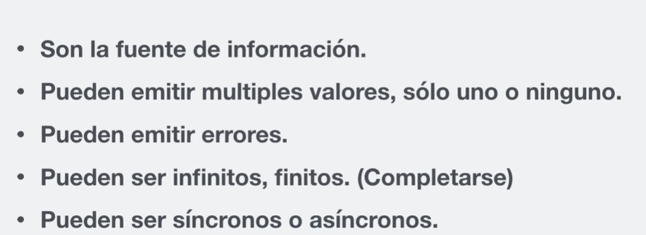

##### Subscribers:
Desconocen todo lo que se encuentra detrás en el observable es decir y desconocen si la información viene filtrada viene transformada viene de alguna otra fuente, pasó por varios lugares a ellos no les interesa.


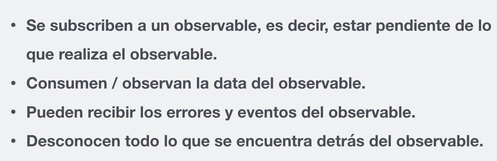

##### Operadores:

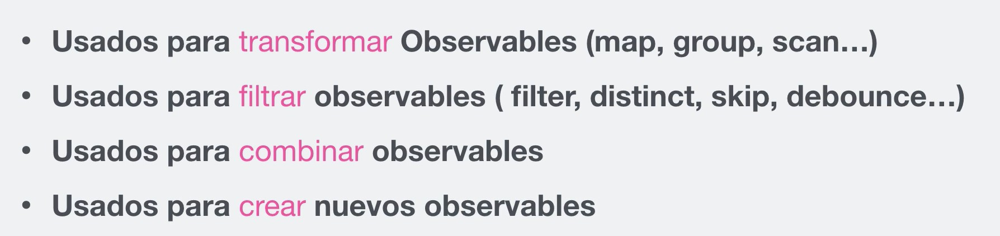

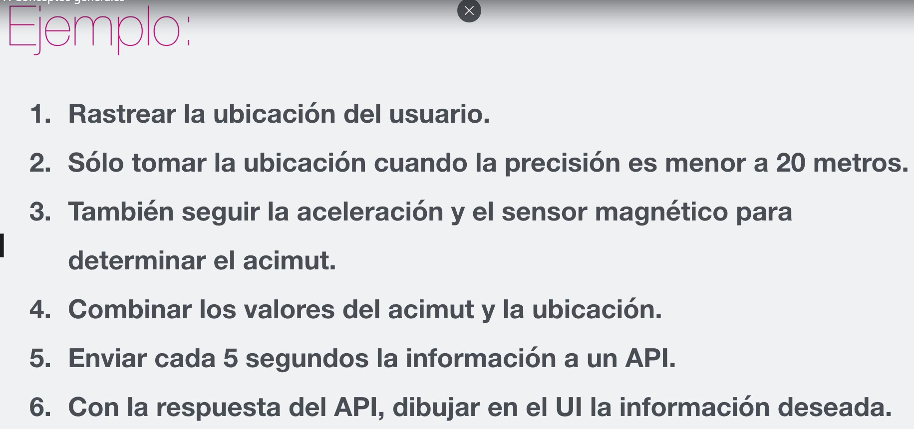

#### Beneficios de la programacion reactiva:

1. Evitar el "Callback Hell".
2. Trabajar de forma simple tareas sincronas y asincronas.
3. Uso de opradores para reduccir y simplicar el trabajo.
4. Es facil transformar los flujos (streams) de informacion.
5. Codigo más limpio y facil de leer.
6. Facil de implementar.
7. Fcail de anexar procedimientos sin alterar el producto final.

### Clase 8: ¿Que es ReactiveX? ¿Como funciona?

Es una API para programacion asincrona usando observable.

ReactiveX es una combinacion de los patrones Observer, Iterador y programacion funcional.

#### Patron Observer:
Es un patron de diseño de software que define una dependencia del tipo uno a muchos entre objetos, de manera que cuando uno de los objetos cambia su **estado**, notifica este cambio a todos los dependientes.

Ejemplo: Un semaforo.

#### Patron Iterador:
En la POO, el patrón interador define una interfaz que declara los métodos necesarios para poder acceder de manera secuencial a un grupo de objetos de una colección.

Ejemplo: Con un array de tamaño **n** crear funciones para saber cual es el _primero()_, _siguiente()_, si _hayMas()_ y cual es el  _elementoActual()_


#### Programcion funcional:

Funciona para crear un conjunto de funciones que tengan un objetivo específico. Es decir que si existe una funcion que reciba **A** y retorna **A+1**, siempre que se llame a esa funcion retornara **A+1**, sin efectos segundarios, sin mutar la data.

__Conslusiones:__
- Patron Observer: notifica cuando suceden cambios.
- Patron iterator: Poder ejecutar operaciones secuenciales.
- Programcion funcional: Tener con tareas específicas que reciban argumentos y no muten la informacion.

### Clase 9: ¿Como leer los diagramas de canicas?

``` 
scan( (x,y) => x + y )
```

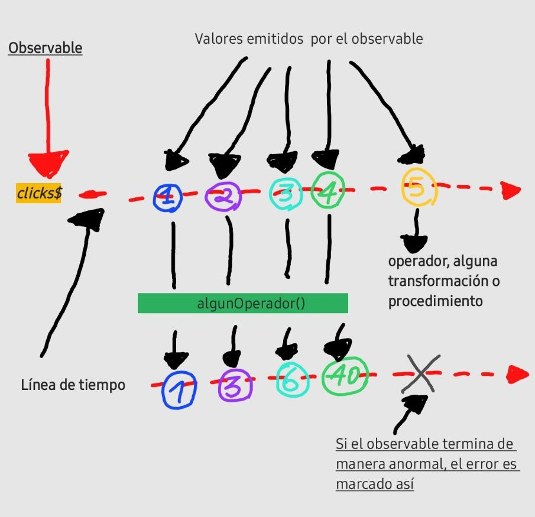


### Clase 10: Configuracion del proyecto

Alojado en GitHub: [Repositorio](https://github.com/Klerith/curso-rxjs-inicio.git)

## Sección 3: Observables

### Clase 12: Temas puntuales

Esta sección abre las puertas de la programacion reactiva, en esta seran veran temas como:
1. Observers
2. Subscriber
3. Unsubscribe
4. Subjects
5. Hot y Cold Observables
6. Observables en cadena
7. Y más

### Clase 13: Nuetro primer observable

Un observable es un elemento que permite emitir valores, aunque algunas veces puede emitir *X cantidad de valore*, puede ser que emita *1*, *0* o *nada*.

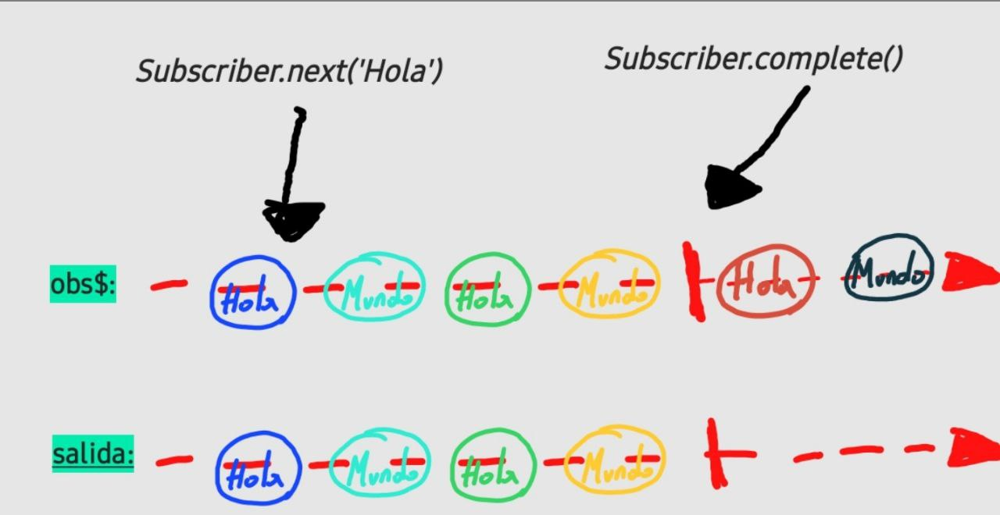

Las subcriciones son las emisiones de nuestro observable, a lo que la gente debe estar pendiende.

__Ejemplo:__ Un chats de WhatsApp donde X persona bloquea a Y persona, por ende por mas que Y persona envie mensajes la persona X no va recibir ninguno de esos mensajes ya que se hizo *subscriber.complete()*
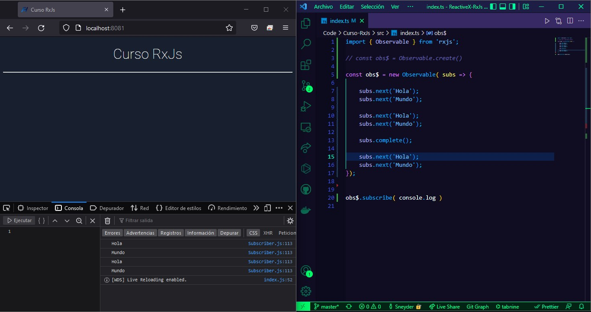

### Clase #14: Observer y suscriber

Formas de llamar un observable:

``` ts
obs$.subscribe( resp => {
    console.log(resp);
})

// Para generar las valdiar los errores antes del complete
obs$.subscribe ( 
    valor => console.log('next:', valor),
    err => console.warn('error:', err), 
    () => console.info('Done')
);

// Importando el Observer de RxJs
// El observe es igual a un objeto, el Observer es una interfez que nos obliga a establecer 
// todo lo que el objeto necesita para ser un observer valido.
const observer: Observer<any> = {
    next: value => console.log('siguiente [next]:', value),
    error: error => console.warn('error [obs]:', error),
    complete: () => console.info('completado [obs]')
}
```

### Clase 15: Nota blioteca de ejercicios

Crear un carpeta para los diferentes ejercicios dentro del curso para que sirva de biblioteca.

### Clase 16: Subcription y Unsubscribe
Una suscripción en RxJS es un recurso desechable que generalmente representa la ejecución de un Observable

``` ts
// Para cancelar una subcricion se utiliza:

setTimeout (() =>{
    subs.unsubscribe()
}, 3000)
```

### Clase 17 Terminar observables en cadena

Los unsubscribe sirven para cortar los flujos de datos o eventos debido a que las subcriones permanecen en memoria y no tine sentido que la subcriones permanezcan ejecutandose en el sistema.

### Clase 18: Subject

Los subjects de RxJs son un tipo de Observable especial que nos permiten realizar diversas tareas como el multicasting, es decir, compartir exactamente el mismo stream de datos con todas las subscripciones sin preocuparnos del tipo de Observable que estamos manejando.

Tiene 3 carecteristicas principales 
1. Casteo múltiple
2. Tambien es un observer
3. Next, error y complete

### Clase 19: Subject 2

Caundo la data es producida por el observable en si mismo, es considerado un __"Cold Observable"__. Pero cuando la data es producida FUERA del observable es llamado __"Hot Observable".__

Permitiendo ingresar informacion al flujo de datos que el Observable esta emitiendo.

Como funcionan: [Blog RxJs](https://pablomagaz.com/blog/rxjs-subjects-que-son-como-funcionan)

## Seccion 4: Funciones para crear Observables

### Clase 22: Temas puntuales de la sección

RxJS proporciona bastantes funcionalidades distintas para crear Observables, algunas de estas son las siguientes:

>
    1. of()
    2. fromEvent()
    3. interval()
    4. timer()
    5. asyncScheduler()

Otras bastante populares son:
>
    1. from()
    2. range()
    3. defer()
    4. ajax()
    5. fromFetch()
    6. generate()

### Clase 23: of

Es una función que nos permite a nosotros crear observables en base a un listado de elementos, nos permite crear Observables a partir de arrays, objetos, strings etc. El Observable emitirá cada argumento que reciba de manera individual, y después será completado

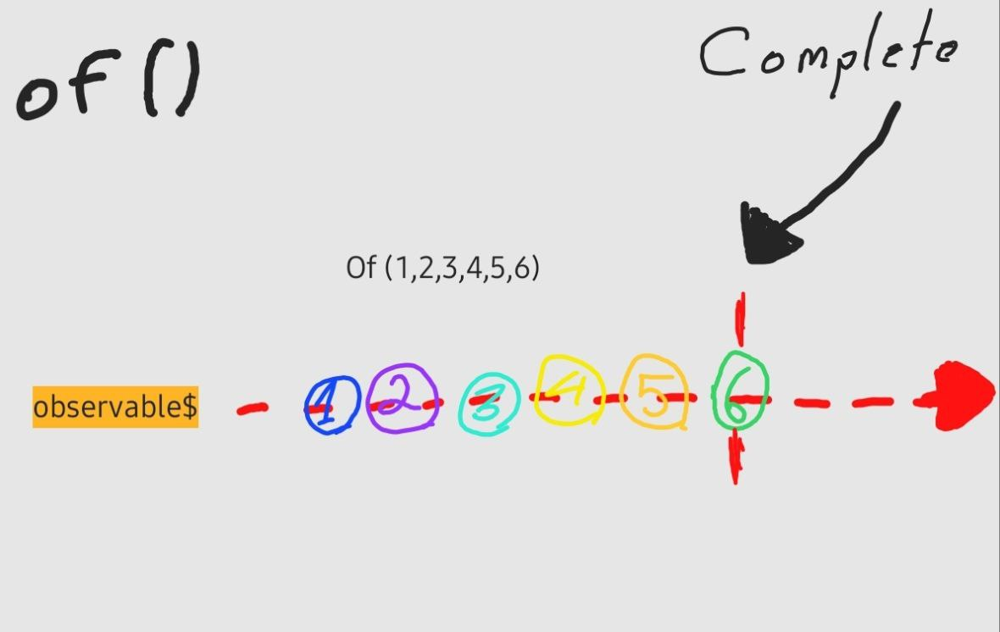

_Nota_: Los observables pueden tambien trabajar de manera asincrona.

### Clase 24: fromEvent

Permite crear observables en base a un inventaria. El _fromEvent()_ recibe dos parametros diferentes:

- El target de evento al que se añadirá la función de manejo de eventos, es decir, el elemento al que vamos a ‘escuchar’ por si se produce un evento o no.
- El tipo de evento al que queremos ‘escuchar’.

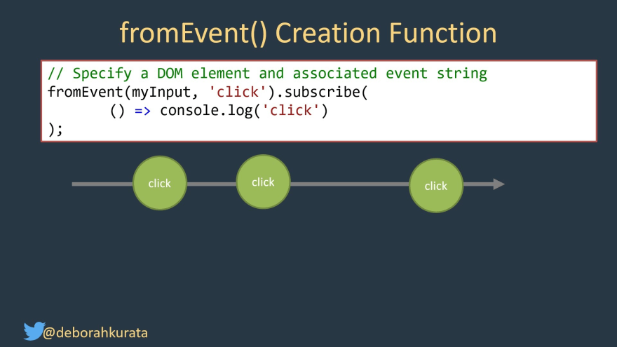

### Clase 25: range

Crea un observable que emite una secuencia de numeros ascendentes con base a un range, este recibe dos parametros:

- El valor inicial del rango.
- La longitud del rango, es decir, la cantidad de números que se emitirán.

``` ts
import {range} from "rxjs"

const number$ = range(5)
```

__Nota__: El range rquiere obligatoriamente el start(primer parametro).


### Clase 26: interval y timer

Son funciones asincronas

El interval emite una secuencia de numeros que va desde 0 hasta el infinito, en un intervalo de tiempo que le asignemos. El parámetro del tamaño del intervalo de tiempo es opcional, con un valor por defecto de 0.

El timer es similar al interval, emite valores despues de tiempo asignado y se completa. Es decir a partir de una demora inicial, empieza a emitir una secuencia ascendente de números, con el intervalo entre emisiones que especifiquemos, la diferencia con la funcion **interval()** es que podemos especificar cuándo queremos que comiencen a producirse las emisiones.

Recibe dos parametros los cuales son: 
- La demora inicial tras la cual se empezarán a emitir valores.
- El valor del intervalo entre emisiones.

__Nota__: Ambos parametros son opcinales, con un valor por defecto de 0.

### Clase 29: asyncScheduler

Este no crear un observable sino una subcripcion. Se utiliza mejor para retrasar las tareas en el tiempo o para programar tareas que se repiten en intervalos.

``` ts
import { asyncScheduler } from 'rxjs';

const task = () => console.log('it works!');

asyncScheduler.schedule(task, 2000);

```

### Clase 30: Mas ejemplos of & from

- of = toma argumentos y genera una secuencia
- from = crear el observable con base a un array, promise, iterable, observable


## Seccion 5: Operadores basicos

### Clase 32: Temas puntuales de la sección:

1. Explicación de los operadores
2. Operadores como:
>
    a. map
    b. pluck
    c. mapTo
    d. filter
    e. tap
    f. reduce
    g. scan
3. Encadenamiento de operadores

### Clase 33: ¿Que son los operadores?

Se emite un flujo de información que controlada(filtrada) donde se acepta la emicion de lo que nos interesa para realizar un trabajo en especifico. Los operadores en _RxJs_ son funciones que construyen sobre la fundación de los observables para tener una manipulación más sofisticada

Que son: [Documentacion](https://puntotech.github.io/rxjs-docu/concepts/operators)

Como funcionan los operadores: [Blog RxJs](https://pablomagaz.com/blog/como-funcionan-operadores-rxjs)

### Clase 34: map

Permite transformar lo que recibe o lo que emite el observable,  aplicando una función de transformación a cada uno de los valores emitidos por la fuente, para obtener los valores de salida correspondientes.

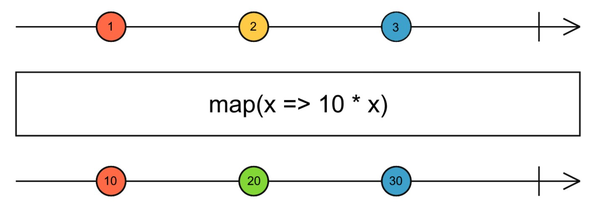

``` ts
import { map } from "rxjs/operators";
import { fromEvent, range } from "rxjs";

const number$ = range(1, 5);

number$.pipe(map((number) => number * 2)).subscribe(console.log);
// Salida: 2, 4, 6, 8, 10
```

### Clase 35: pluck

Sirve para cuando queremos extraer el valor del objeto que estamos recibiendo y buscamos que esa sea la nueva salida del observable. Es como *map*, pero se utiliza para extraer una de las propiedades anidadas de los objetos emitidos.

Dada una lista de cadenas que describan la ruta de una propiedad de un objeto, obtiene el valor de la propiedad anidada especificada de todos los valores del Observable fuente. Si la propiedad no existe, se devolverá undefined para ese valor en concreto.

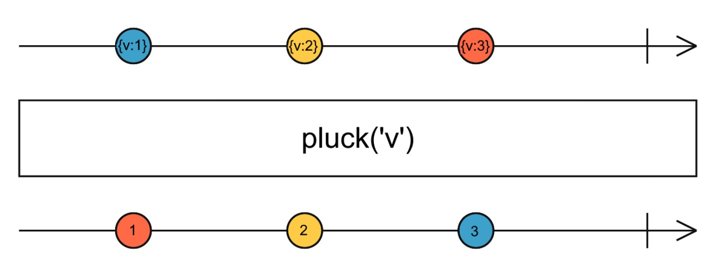

``` ts
import { pluck } from "rxjs/operators";
import { from } from "rxjs";

const language$ = from([
  { name: "Ruby", type: "Multiparadigma" },
  { name: "Haskell", type: "Funcional" },
  { name: "Rust", type: "Multiparadigma" },
]);

language$.pipe(pluck("name")).subscribe(console.log);
// Salida: Ruby, Haskell, Rust
```

### Clase 36: mapTo

 Recibe un valor constante como argumento, que emite cuandoquiera que el Observable fuente emita un valor. En otras palabras, ignora el valor emitido, y simplemente utiliza el momento de emisión para saber cuándo emitir el valor constante proporcionado.**Es como map, pero proyecta cada emisión siempre al mismo valor.**

``` ts
import { mapTo } from "rxjs/operators";
import { interval } from "rxjs";

const number$ = interval(1000);

number$.pipe(mapTo("La respuesta es 42")).subscribe(console.log);
// Salida: La respuesta es 42, La respuesta es 42, La respuesta es 42, La respuesta es 42...
```

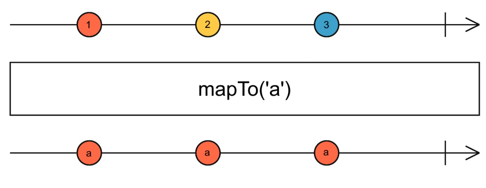

### Clase 37: filter

Simplimente toma o rechaza ciertos valores según los criterios de filtrado, solo emitiendo un valor si cumple una condición determinada.

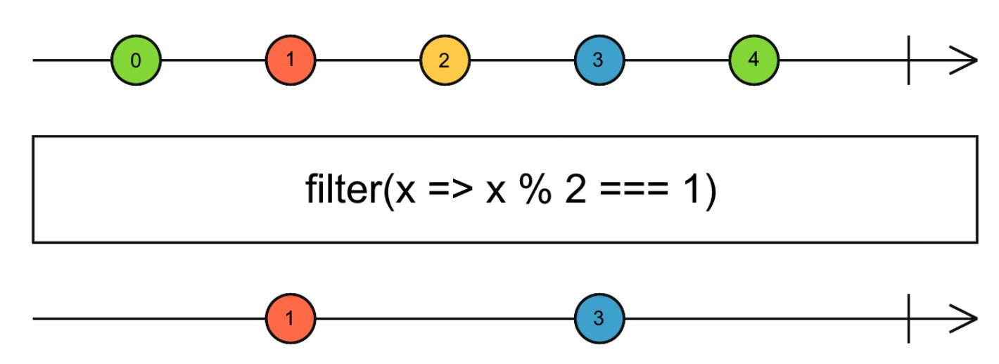

### Clase 38: Cadena de operadores

_Nota:_ El orden de la cadena determina la salida

``` ts
const keyup$ = fromEvent<KeyboardEvent>(document, 'keyup').pipe(
    map( event => event.code), //keyboardEvent, string
    filter( key => key === 'Enter' )
);
```

### Clase 39: tap

Es un operador de utilidad que lleva a cabo un efecto colateral en cada emisión del Observable fuente, pero retorna un Observable que es idéntico a la fuente. Retorna un Observable que refleja al Observable fuente, pero modificado de tal manera para que el Observador que se le haya proporcionado al operador pueda ser llamado para llevar a cabo un efecto colateral por cada valor, error o completación emitidos por el Observable fuente.

``` ts
import { of } from "rxjs";
import { map, tap } from "rxjs/operators";

const fruit$ = of("Cereza", "Fresa", "Arándano");

fruit$
  .pipe(
    tap((fruit) => console.log(`Antes: ${fruit}`)),
    map((fruit) => fruit.toUpperCase()),
    tap((fruit) => console.log(`Después: ${fruit}`))
  )
  .subscribe();

/* Salida:
Antes: Cereza, Después: CEREZA,
Antes: Fresa, Después: FRESA,
Antes: Arándano, Después: ARÁNDANO
*/
```

### Clase 42: reduce

Es un operador matetico de agregacion , donde se aplica una función acumuladora al Observable fuente y retorna el resultado acumulado una vez se completa la fuente.

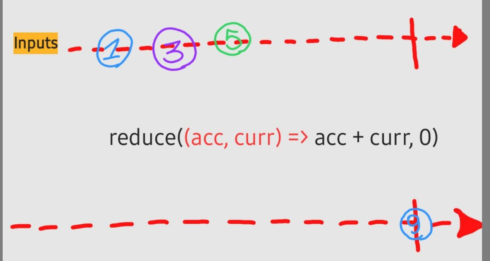

__Nota:__ *acc* es acumulado, *curr* es el actual y el *0* es valor inicial

### Clase 43: scan

Tambien es un operador matetico de agregacion pero que a diferencia del _reduce_ este emite cada valor de la acumulacion.

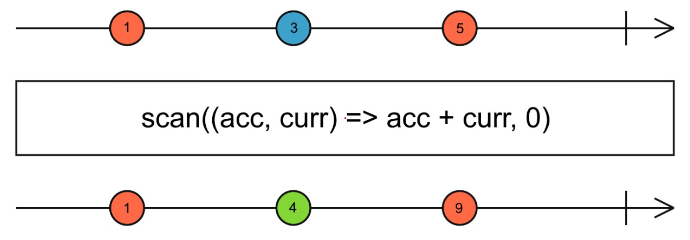

## Seccion 6: Operadores no tan comunes

### Clase 46: Temas puntuales de la sección

1. take
2. first
3. takeWhile
4. takeUntil
5. skip
6. distinct
7. distinctUntilChanged
8. distinctUntilKeyChanged

### Clase 47: take

Este operador emite las primeras x emisiones del Observable fuente, obtiene los primeros count valores de la fuente, y se completa.

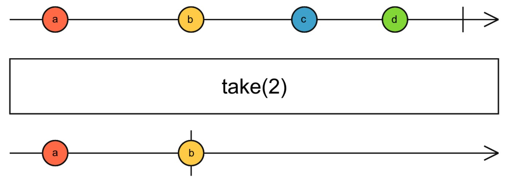

### Clase 48: firts

Emite el primer valor (o el primer valor que cumpla una condición) emitido por un Observable.


_Nota:_ Si se llama sin ningún argumento, first emite el primer valor del Observable fuente y se completa.


### Clase 49: takeWhile

Emite las emisiones del Observable fuente siempre y hasta cuando cumplan la condición especificada. Se completa en cuanto haya un valor que no cumpla la condición.


### Clase 50: takeUntil

Emite los valores emitidos por el Observable fuente hasta que un segundo Observable emita un valor, pasando valores de la fuente observable al observador, hasta que un observable proporcionado conocido como notificador emite su primer valor. **Si el notificador emite u valor, cancela la suscripcion y se completa**

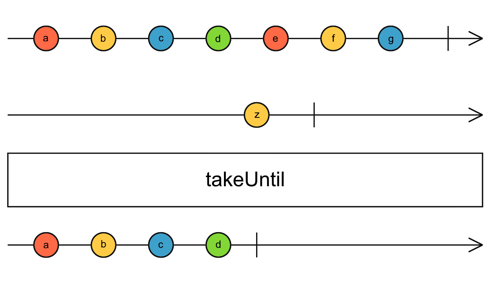
Referencias: [TakeUntil](https://indepth-dev.translate.goog/reference/rxjs/operators/take-until?_x_tr_sl=en&_x_tr_tl=es&_x_tr_hl=es-419&_x_tr_pto=op,sc)

### Clase 51: skip

Retorna un Observable que se salta las primeras x emisiones del Observable fuente,`skip` se salta un número determinado por el parámetro count de emisiones del Observable fuente, y después continúa emitiendo valores normalmente.

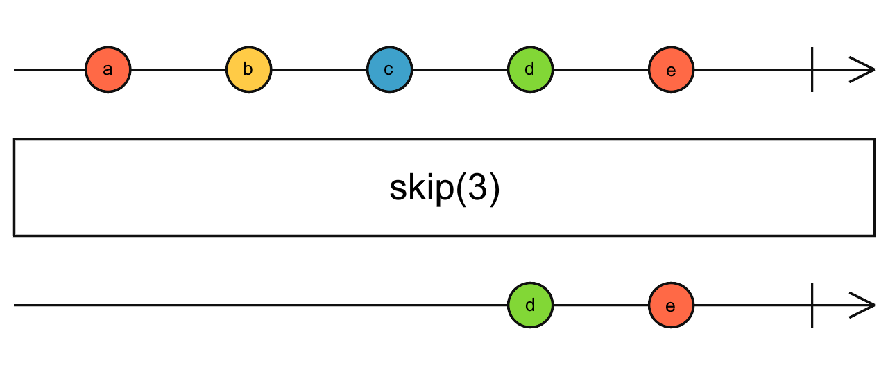

### Clase 52: distinct

Retorna un Observable que emite todos los elementos del Observable fuente que sean distintos a los elementos anteriores

_Nota_: 
> Si se proporciona una función keySelector, se proyectará cada valor emitido por el Observable fuente a un nuevo valor, que se comparará con los valores previamente emitidos para ver si es distinto o no. Si no se proporciona una función keySelector, se compararán los valores emitidos por el Observable fuente directamente con las emisiones previas.

``` ts
import { distinct } from "rxjs/operators";
import { of } from "rxjs";

const fruit$ = of(
  "Fresa",
  "Cereza",
  "Cereza",
  "Arándano",
  "Fresa",
  "Arándano",
  "Cereza"
);

fruit$.pipe(distinct()).subscribe(console.log);
// Salida: Fresa, Cereza, Arándano
```

### Clase 53: distinctUntilChanged

Funciona de manera muy similar al distinct solo que en este caso en vez mirar todo el observable, solo le importa el anterior.Retorna un Observable que emite todos los elementos emitidos por el Observable fuente que sean distintos al valor anterior

``` ts
import { distinctUntilChanged } from "rxjs/operators";
import { of } from "rxjs";

const fruit$ = of("Fresa", "Cereza", "Cereza", "Arándano", "Arándano", "Fresa");

fruit$.pipe(distinctUntilChanged()).subscribe(console.log);
// Salida: Fresa, Cereza, Arándano, Fresa
```

### Clase 54: distinctUntilKeyChanged

Retorna un Observable que emite los elementos del Observable fuente cuya propiedad especificada sea distinta a la del elemento anterior

_Nota_
> Si se proporciona una función de comparación, se utilizará para comprobar si cada elemento se debe emitir o no.

Si no se proporciona una función de comparación, se utiliza una verificación de igualdad.

``` ts
// Emite el objeto lenguaje si su propiedad name es distinta a la del objeto anterior

import { distinctUntilKeyChanged } from "rxjs/operators";
import { of } from "rxjs";

const language$ = of(
  { name: "Java", type: "Orientado a objetos" },
  { name: "Ruby", type: "Multiparadigma" },
  { name: "Ruby", type: "Multiparadigma" },
  { name: "Haskell", type: "Funcional" },
  { name: "Haskell", type: "Funcional" },
  { name: "Java", type: "Orientado a objetos" },
  { name: "Ruby", type: "Multiparadigma" }
);

language$.pipe(distinctUntilKeyChanged("name")).subscribe(console.log);
/* Salida:
  { name: "Java", type: "Orientado a objetos" },
  { name: "Ruby", type: "Multiparadigma" },
  { name: "Haskell", type: "Funcional" },
  { name: "Java", type: "Orientado a objetos" },
  { name: "Ruby", type: "Multiparadigma" }
*/
```

## Seccion 7: Operadores que trabajan con tiempo

### Clase 57: Temas puntuales de la sección

Los operadores de tiempo del tiempo, son los que buscan trabajar con _intervalos de tiempo_.

1. debounceTime
2. throttleTime
3. sampleTime
4. sample
5. auditTime

### Clase 58: debounceTime

Este operador emite un valor del Observable _si y solo si_, pasa un periodo de tiempo determinado sin que este emita ningún valor.

El `debonceTime` retrasa los valores del Observable si este emite un valor antes de que pase el periodo de tiempo, el valor almacenado será eliminado, y nunca se emitirá en el Observable resultante.

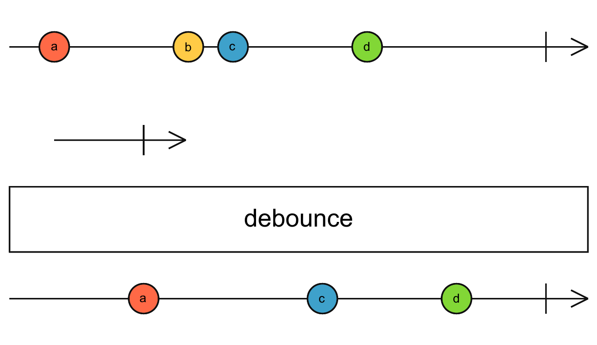

### Clase 59: throttleTime

Emite un valor del Observable fuente e ignora las emisiones siguientes durante un periodo de tiempo determinado. Después, repite el proceso.

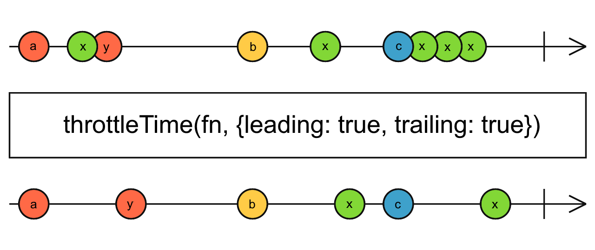

### Clase 60: sampleTime

Emite la emisión más reciente del Observable fuente en cada periodo de tiempo determinado

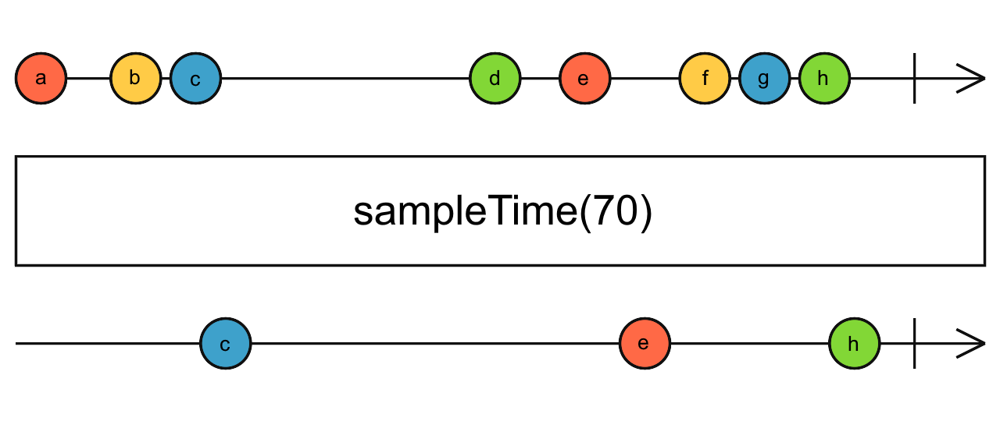

### Clase 61: sample

Este operador muestra la emisión más reciente del Observable fuente cuando un segundo Observable, el notificador, emite un valor.

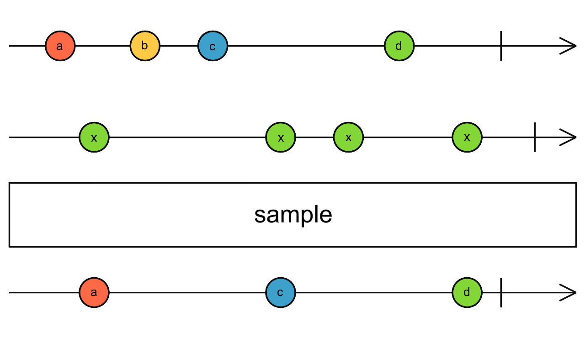

### Clase 62: auditTime

Ignora los valores de la fuente durante un periodo de tiempo, tras el cual emite el valor más reciente del Observable fuente. Cuando recibe un valor de la fuente, lo ignora, además de todos los valores posteriores durante un periodo de tiempo. Una vez finalizado el periodo de tiempo, emite el valor más reciente del Observable fuente.

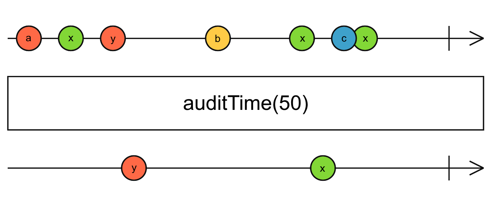

## Seccion 8: Peticiones ajax usando RxJs/ajax

### Clase 65: Temas puntuales de la sección

En esta sección no solo se trabaja con peticiones ajax, si no que tambien tambien también configuraremos headers.

__Los temas principales__:
1. Conceptos básicos de una petición ajax
2. Manejo de errores
3. Fetch API
4. getJson
5. Ajax
6. Diferencia entre getJson y Ajax
7. PUT, POST, DELETE, GET

### Clase 68: Peticcion usando ajax de RxJS - catchError

Ajax es un operador de creacion donde se crea un Observable para una petición Ajax a partir de un objeto de petición con la url, cabeceras etc. o a partir de una URL. CatchError es un operador que Captura errores en el Observable que se manejan devolviendo un Observable nuevo o lanzando un error

```ts
import { ajax } from "rxjs/ajax";

const ghibliFilmsResponse$ = ajax("https://ghibliapi.herokuapp.com/films");

ghibliFilmsResponse$.subscribe(console.log);
// Salida: AjaxResponse { ...request: {...}, status: 200...}
```

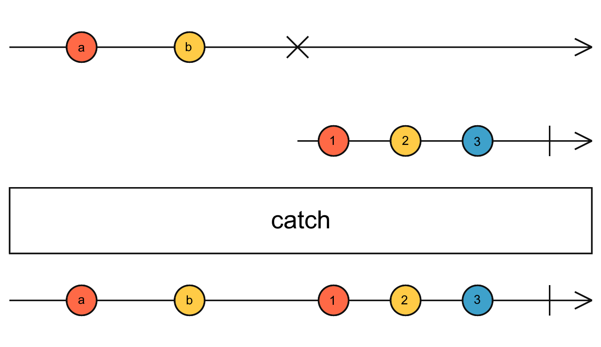


### Clase 69: getJSON

Este metodo nos sireve para manejar los headers y traer los datos que se necesiten de la peticion ajax.

## Seccion 9: Operadores de transformacion.

### Clase 74: Temas puntuales de la sección

Aveces cuando obtenemos informacion es muy poco legible es por esto que para mejorar ReactiveX trae las siguientes funciones y operadores:

1. mergeAll
2. mergeMap
3. switchMap
4. concatMap
5. exhaustMap

### Clase 76: mergeAll

Este operador crea un Observable de salida que emite concurrentemente los valores de todos los Observables de entrada, que termina uniendo varios Observables en uno solo.

_Nota_:
> `merge` se subscribe a cada Observable de entrada de forma concurrente, y emite sus valores, sin transformarlos, en el Observable resultante. El Observable resultante solo se completa cuando todos los Observables de entrada se hayan completado.

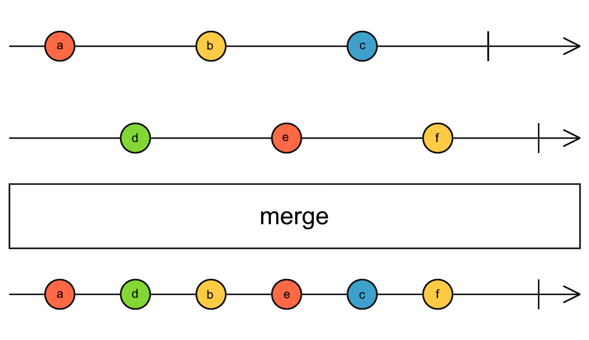

### Clase 77: Tipando los operadores

Recordar que TypeScript cuando le ponemos un tipado permite detectar errores de asigancion en tiempo de desarrollo.

### Clase 78: mergeMap

Este operador proyecta cada valor emitido por la fuente a un Observable interno que se fusiona en el Observable resultante esto funciana con ayuda del operador `mergeAll`, retornando un Observable que, después de aplicar una función a cada elemento emitido por el Observable fuente, donde dicha función retorna un Observable, fusiona los Observables internos resultantes y emite el resultado de la fusión.

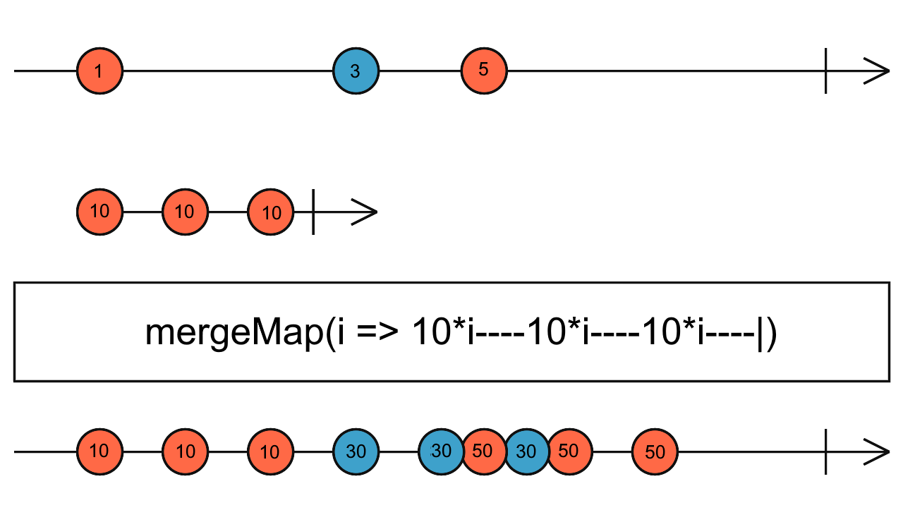

### Clase 79: switchMap

Su funcionamiento es similiar al `mergeMap` sin embargo este retorna un Observable que emite elementos tras **aplicar una función a cada elemento emitido** por el Observable fuente, osea que hasta que no se completa el observable no se completa no puede iniciar con el otro por ende cancela el ultimo.

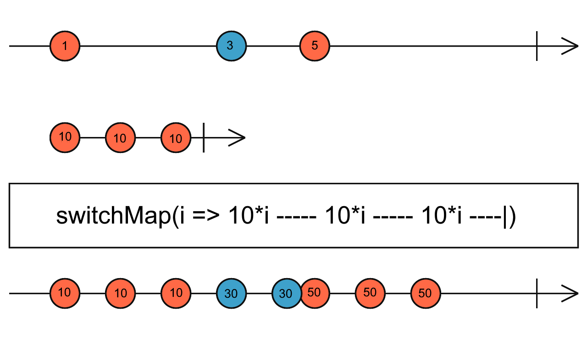
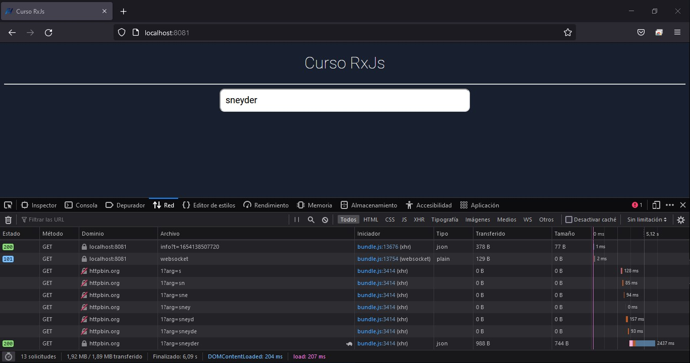

### Clase 80: switchMap vs MergeMap

Ambos permiten controlar un observable a partir de los elementos de otro, de este modo podemos generar un tercer observable como resultado (o devolver el segundo observable modificado), su principal diferencia radica en que: A diferencia de `MergeMap`, si el primer observable retorna un nuevo valor `SwitchMap` cancela la suscripción actual, no existe la posiblidad de que haya ejecuciones en paralelo como con `MergeMap`.

### Clase 81: concatMap

Es otro operador de aplacamiento que proyecta cada valor emitido por la fuente a un Observable interno que se une al Observable resultante de forma secuencial, esperando a que cada Observable interno esté completo antes de unir el siguiente.

_Notas_:
> Se debe utilizar `concatMap` si se quiere esperar a que cada Observable interno esté completo antes de suscribirse al siguiente

> A diferencia del `switchMap` este espera que el otro se complete el observable y no lo cancela.

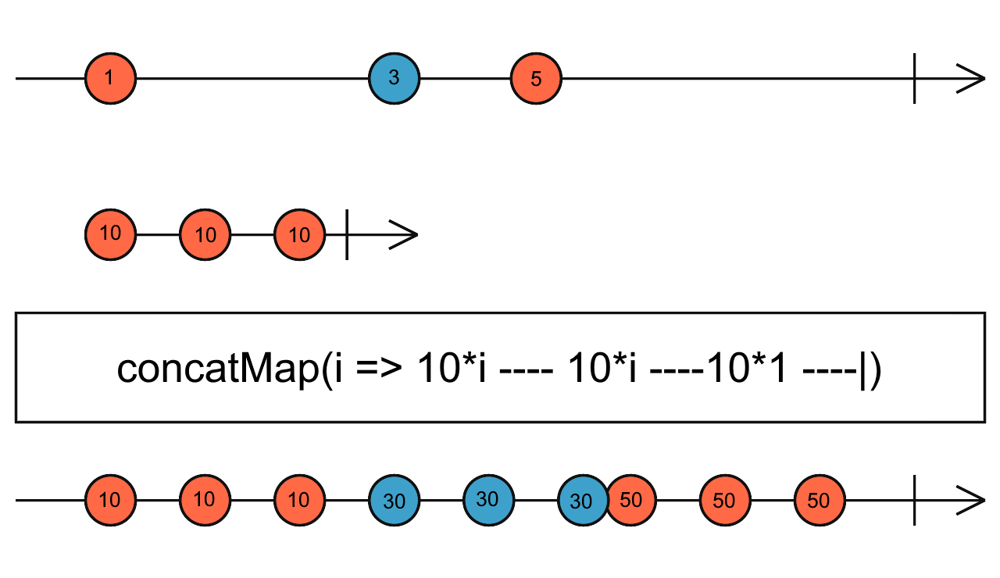

### Clase 82: exhaustMap
Proyecta cada emisión de la fuente a un Observable interno que se fusiona con el Observable resultante únicamente si el Observable interno anterior se ha completado.

Este operador es util cuando tenemos objetos o elementos que estan haciendo demasiado spam o estan lanzando varios eventos rapidamente, el uso principal de `exhaustMap` se reduce a cuando tenemos muchos valores que se pueden ignorar.

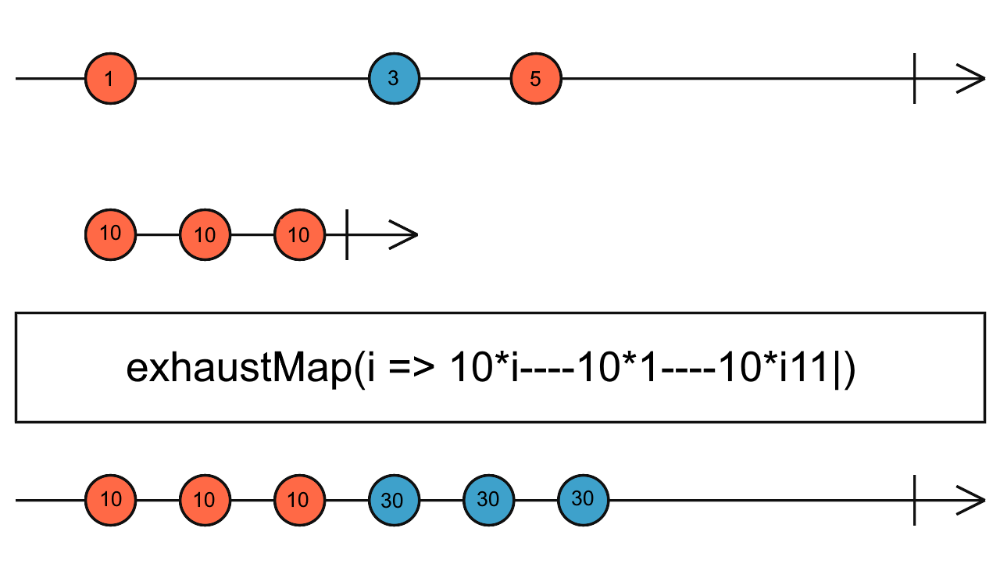

## Seccion 10: Operadores y metodos de combinancion de observables.